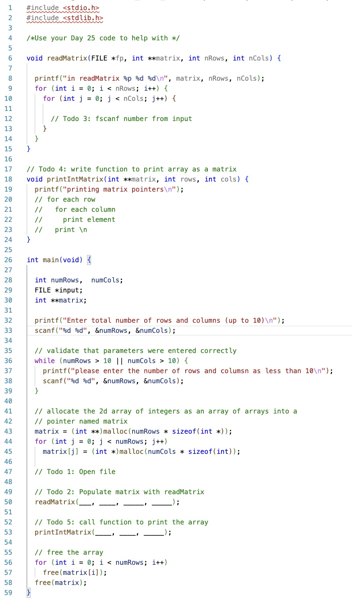

# CS100-Actvities

## Day

## Knowledge

* Reference and dereference operator
* Local variables
* Using pointers as function parameters
* Malloc and free function for variables
* Malloc/free for arrays and strings
* Typecasting with malloc
* sizeof macro
* Passing pointers as a mechanism to return multiple modified values via the parameter list

## Skills

_Programming skills:_

Write, compile, and execute syntactically and logically correct code that:

* Obtains variable locations using reference operator,
* Accesses variable values by dereference operator,
* Uses pointers in assignments
* Modifies variable contents using pass by pointer,
* Passes reference types into function using pass by pointer including arrays and strings,
* Dynamically allocates space for a multiple dimension array using malloc, type casting and the sizeof macro,
* Accesses and modifies elements in a dynamically allocated data structure using dereferencing

_Debugging skills:_

Use debugging strategies (printf/debugger) to:

* Verify a pointer operation as iterates through an array or C string correctly by tracing its execution
* Verify that parameters of pointer types are passed correctly, and mutations enabled by passed pointers are performed correctly

## Assignment
Update [main.c](main.c) to read and process a two dimensional array.  Store the data using an array of rows.

- Todo 1: Write statement to open file

- Todo 2: Complete readMatrix function call with parameters that use readMatrix to populate matrix 

- Todo 3: Update readMatrix to use fscanf to read the elements from file into matrix 

- Todo 4: Complete  printIntMatrix function to print array as a matrix

- Todo 5: Complete function call function to print the array using printIntMatrix

## Files

[main.c](main.c)

## Solution

[main-solution.c](main-solution.c)