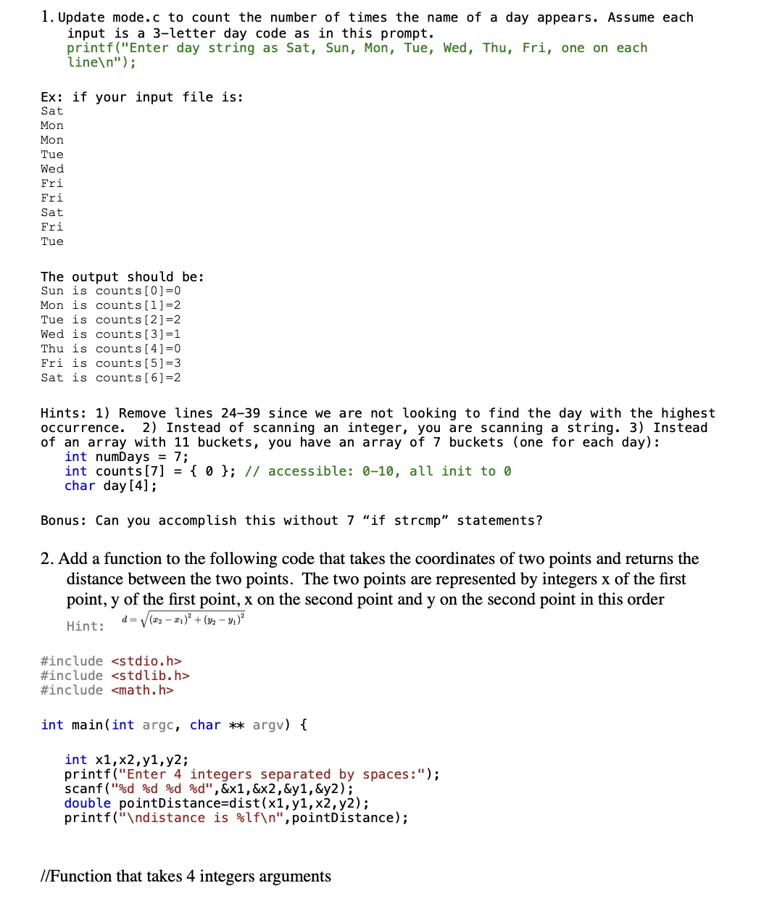

# CS100-Actvities

## Day

## Knowledge
* Function signature and syntax
* Function definition
* Parameter definition as formal parameters
* Calling custom functions
* Return of primitive types
* Block scope variable visibility
* Debug function calls and definitions

## Skills

__Programming skills__

Write, compile, and execute syntactically and logically correct code that:

* Defines a function as a return type, a function name and a set of parameters, each with its own type,
* Puts redundant code in a function,
* Passes required data for function processing via the function parameters,
* Returns data from the function to the calling statement

__Debugging skills__

Use debugging strategies (printf/debugger) to:

* Verify that parameters are passed into functions as expected
* Verify return values are calculated correctly

## Assignment

Turn in the code from questions 1 and 2.  

## Files
[Worksheet](functions.docx) 
[Link to prev mode.c](../Array-of-Chars/mode.c)

## Solution

[days\_of\_week\_array.c](days_of_week_array.c) 
[dist_function.c](dist_function.c)
