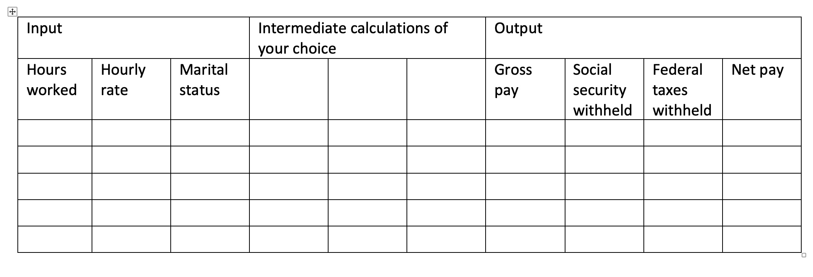
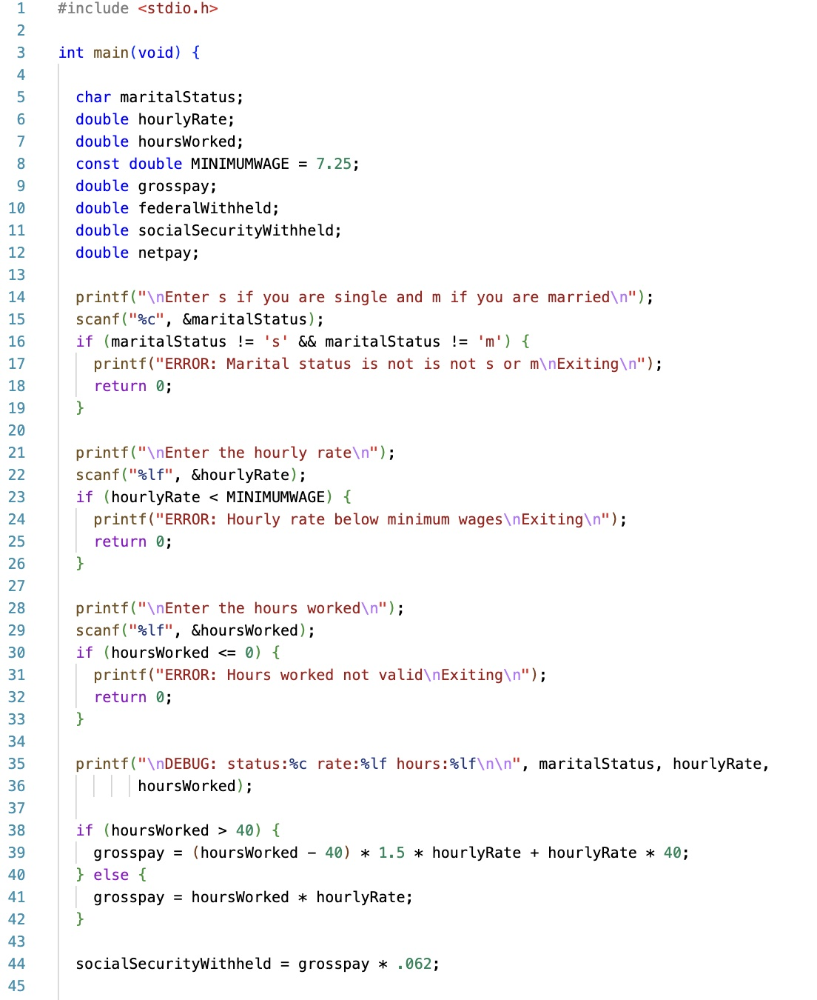
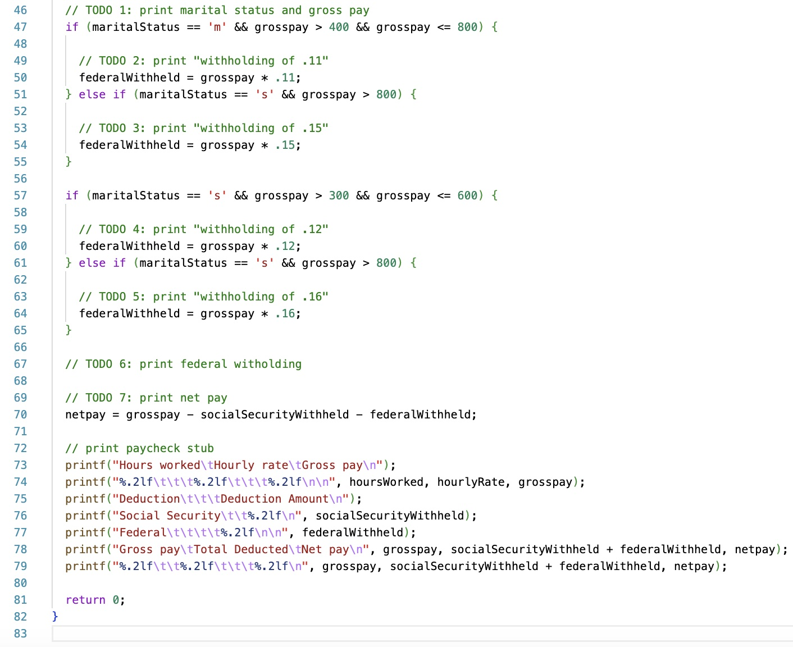

# CS100-Actvities

## Day

## Knowledge
* If vs if-else vs if-else if-else branching logic
* Create statement block
* If-then-else syntax
* Order of evaluation
* Equality/inequality
* Relational operators
* Logical operators
* Debug branching logic

## Skills
_Design skills:_

Make appropriate design decisions when:

* Choosing expressions and branching structure

_Debugging skills:_

Use debugging strategies (printf/debugger) to:

* Verify branching logic by printing/examining variable values before expression evaluation and comparing to code blocks executed

## Assignment
Find errors in the payroll calculation program.

1. The program calculates the employee checks. The following rules apply to paycheck calculation
  1. Gross pay is the total of regular and overtime pay.
  2. Regular pay is the hourly rate \* hours worked for up to 40 hours worked
  3. Overtime pay is hourly rate \* number of hours worked over 40 \* 1.5
  4. All employees have 6.2% of their check withheld for social security
  5. For federal taxes, married employees will have no taxes withheld if their gross pay is less than or equal to $400, 11% if the gross pay is greater than $400 but less than $800 and 15% if the gross pay is $800 or more
  6. For federal taxes, single employees will have no taxes withheld if their gross pay is less than or equal to $300, 12% if the gross pay is greater than $300 but less than $600 and 16% if the gross pay is $600 or more
  7. Net pay is the gross pay minus the social security withheld and the federal taxes withheld
  8. The hourly rate must be at or greater than the minimum wage (currently $7.25 in Alabama)
  9. If the hour rate is too low, there are no hours worked (hours worked reported is not a positive number) or the marital status is not 's' or 'm', print an error and exit.

1. Complete the table below to complete your test cases. You should add intermediate values as needed (\* ignore the rounding error for now.)

1. Download the attached code. It contains a calculation error. Identify a test case that fails.
  1. Add printf statements to print the values before each expression and to print a notification of which branch is being taken
  2. Try values at the thresholds (for example, gross pay equal to 399, 400, 401, 799, 800, or 801 for married employees would test all the branches of the federal withholding calculation)
  3. Verify relational (\<,\>,\<=,\>=) and logical operators (&&, ||)

## Files

Worksheet [pdf](Payroll assignment worksheet.pdf) | 
[docx](Payroll assignment worksheet.docx)

[Presentation](Presentation.pptx) 
[payroll.c](payroll.c)

## Solution

To Be Added

## Notes

This payroll problem is revisited in lessons [Structs](../Structs/README.md) and [Struct Arrays](../Struct-Arrays/README.md)