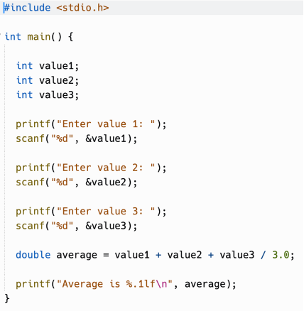
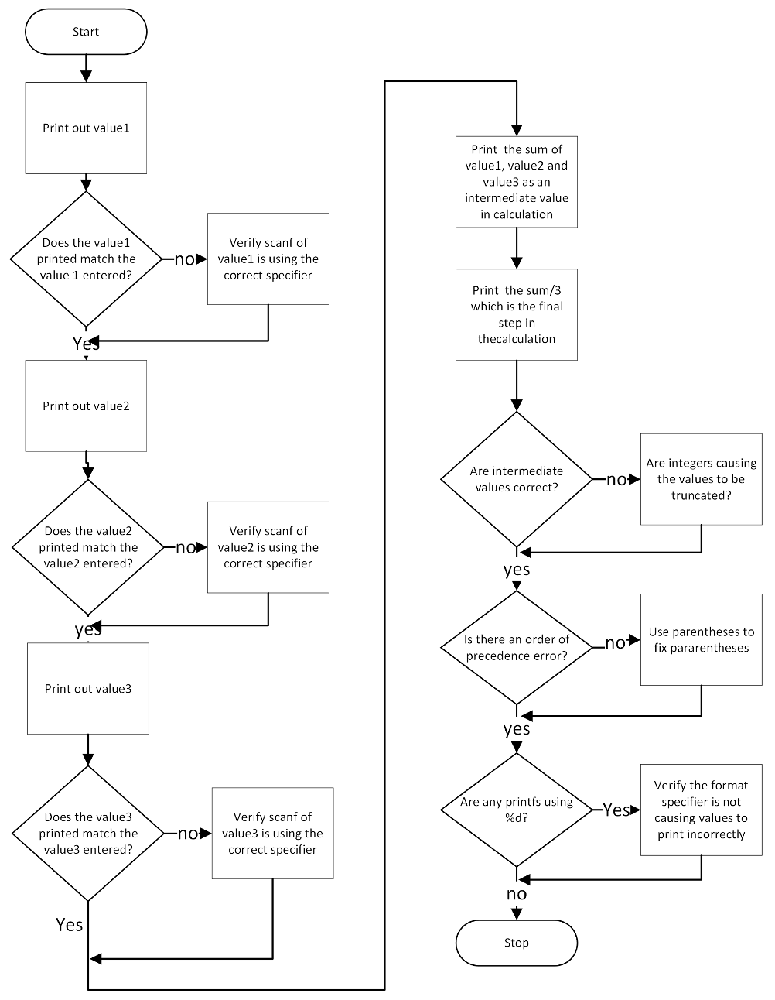

# CS100-Actvities

DEBUGGING 1 (folder debugging1)

## Knowledge Needed

* Compile and run program
* Keyboard is the standard form of input
* Variables as named storage
* Basic program syntax (main shell, stdio, scanf, printf)
* Declare, allocate and initialize whole numbers (int) 
* Read values from keyboard into variables of int
* Compiling and fixing syntax errors
* Operator precedence
* Format specifiers and format string
* Newline control character (\n)
* Debugging to verify logic

## Skills 

_Debugging skills:_

Use debugging strategies (printf/debugger) to:

- Identify arithmetic operation issues by tracing calculations,

- Verify input is saved properly

## Assignment
1.	The code below reads in three integer values and returns the average of the three numbers.  If value1 is 3, value2 is 4 and value3 is 5, what should be returned as the average?

 

2.	Type in the code.  Compile and execute the code.  Does it calculate the average correctly?

3.	What are the possible causes of the error? How can you verify your assumptions about what the code does?

4.	Follow debugging step on the attached flowchart.  Do any of the steps highlight the bug in the program?

## Files
[Slides-pdf](handout.pdf) | [Slides-pptx](Debugging1.pptx)

[Worksheet](debug-assignment.docx)

## Solution