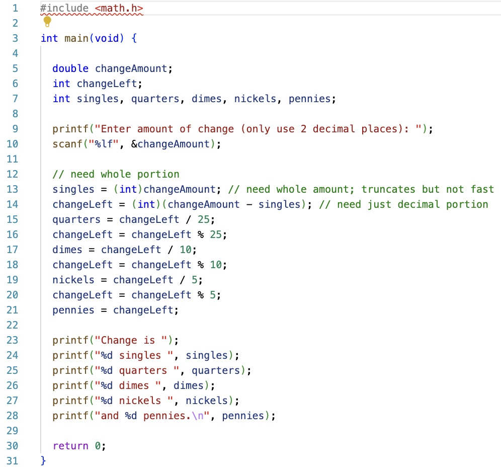

# CS100-Actvities


## Day

## Knowledge
* File as unit of persisted named storage and file types
* Compile and run program
* Keyboard is the standard form of input
* Variables as named storage
* Declare, allocate and initialize whole numbers (int) 
* Read values from keyboard into variables of int
* Compiling and fixing syntax errors
* Format of assignment statements incl with same var on both sides
* Identifier naming requirements/reserved words
* Operators incl unary and compound
* Operator precedence
* Integer divide and modulo
* Declare, allocate and initialize floating point (double) types
* Read values from keyboard into variables of double
* Type conversion and casting
* Format specifiers and format string
* Newline control character (\n)
* Single and multiline comments
* Debugging to verify logic


## Skills

_Programming skills:_

Write, compile and execute a syntactically and logically correct C program that:

* Reads in a series of integer or real values,
* Performs correct calculations using operators, type conversion and casting, numeric, constants and math functions considering operator precedence,
* Prints formatted output using string literals, format specifiers, and control characters, and
* Follows acceptable style, white space, and naming conventions.

_Debugging skills:_

Use debugging strategies (printf/debugger) to:

* Identify arithmetic operation issues by tracing calculations,
* Verify input is saved properly, and
* Locating output formatting issues.

## Assignment
Find and fix the error in [making-chg.c](making-chg.c)

To compile the program, remember the following command.

```
gcc –o <outputfilename> <sourcefilename>

gcc -o debug debug.c
```




## Files
[Slides-pdf](Debugging2.pdf) | [Slides-pptx](Debugging2.pptx)
<br>
[making-chg.c](making-chg.c)

## Solution
[making-chg-solution.c](making-chg-solution.c)

## Notes
Students were not given making-chg.c, just the code on the worksheet.  Typing in the code gave students the opportunity to resolve sytax errors.
