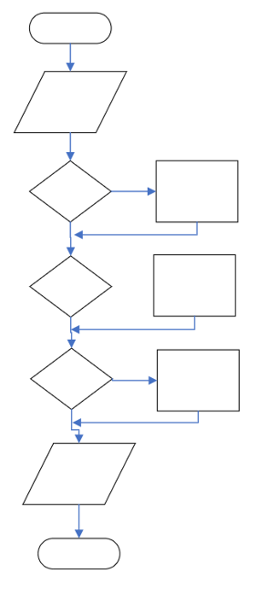

# CS100-Actvities

## Day

## Knowledge
* If vs if-else vs if-else if-else branching logic
* Create statement block
* If-then-else syntax
* Relational operators

## Skills
_Design skills:_

Make appropriate design decisions when:
* Choosing expressions and branching structure

_Programming skills:_

Write compile and execute syntactically and logically correct C program that:

* Uses expression (single or compound) to selectively execute a block of statements

## Assignment

Complete worksheet activities

1.	Create a flowchart from code in  
[Zybooks Figure 3.3.1](zybooks3.3.1.jpg)

2.	Create a flowchart from code in 
[Zybooks Figure 3.7.1](zybooks3.7.1.jpg)

3.	Write a novel program description that matches the flowchart below.  Code the program that implements the logic you describe.

## Files
[Worksheet](Flowchart existing code.docx)

## Solution

To Be Added

## Notes

Students completed an online flowcharting lesson.  They are also exposed to flowcharting in the [Debugging](../Debugging1/README.md) actvitiy (it captures the logic of finding an error)
