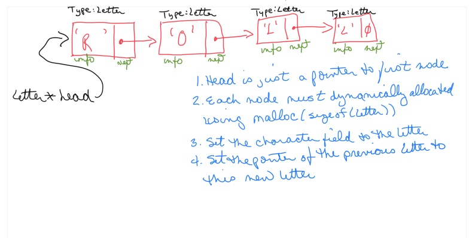

# CS100-Actvities


## Day

## Knowledge

Structure of a recursive algorithm/function
Identify the base case(s) in a recursion
Identify which variable is updated for the recursive case
Trace the execution of a recursion by printing the parameters passed during each recursive step

## Skills

_Design skills:_ 

Make appropriate design decisions when:

-   Identifying the parameters in a recursive call

-   Identifying the base case that stops the recursion

_Programming skills_ 

Write, compile, and execute syntactically and logically correct code
that:

-   Implements a basic recursion that correctly updates the parameters
    for each recursion and stops the recursion after the base case is
    reached

_Debugging skills:_ 

Use debugging strategies (printf/debugger) to:

-   Print statements that trace the execution of a recursive algorithm


## Assignment


  ## Steps
  
  Using [main.c](main.c):
  
  1. Follow the logic of the building of the linked list
  2. Update printlist to print the word in the linked list
  3. Look at the logic to build the list backwards (don't need to track two pointers). 

  
```C
./main
Enter a word: tide
t-->i-->d-->e
```


## Files

[main.c](main.c)


## Solution

solution.c