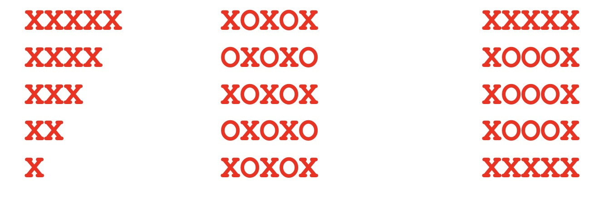

# CS100-Actvities

## Day

## Knowledge
* Loop logic
* Syntax of while
* Syntax of for loop/++/-- operators; break/continue
* Loop semantics of initial value, value update and test expression
* Choosing for vs while loop
* For/while loops over C string 
* Variable scope in for block (C99 internal declaration)
* Debug single or nested looping logic 

## Skills
_Design skills:_

Make appropriate design decisions when:

* Choosing between while loops and for loops, and
* Apply continue in a clear and consistent manner

_Programming skills:_

Write compile and execute syntactically and logically correct C program that:

* Write compile and execute syntactically and logically correct C program that:
* Uses while or for loop to execute a block of statements zero, one or many times based on an expression
* Loops based on number received from user
* Uses user input to loop until a special character is received
* Uses a nested loop to processes multidimensional data like a matrix

_Debugging skills:_

Use debugging strategies (printf/debugger) to:

* Verify that expressions that drive loops function as expected

## Assignment

1.	Each of the following code snippets features one loop nested in another loop.  The novelty is that there are two indexes: 1) a for the outer loop and 2) b for the inner loop.  They increment independently.  Predict what will be printed in each of the following code snippets.  Assume 5 is the value provided by the user.

a.	

	printf(“Enter a number:\n“);
	int num;
	scanf(“%d”, &num);
	for (int a=0; a<num; a++) {
		for (int b=0; b<num; b++)
			printf("<%d-%d> ", a, b);
		printf("\n");
	}
 
b.	

    printf(“Enter a number:\n“);
    int num;
    scanf(“%d”, &num);
    for (int a = 0; a < num; a++) {
        for (int b = 0; b <= a; b++)
            printf("X");
        printf("\n");
    }

2.	Program and execute both snippets to determine if your prediction was right.

3.	Create a program that generates one of the patterns below.  You should extrapolate what the pattern would be for different integer inputs from the user.

## Files
[Worksheet](nested loops.docx)

## Solution