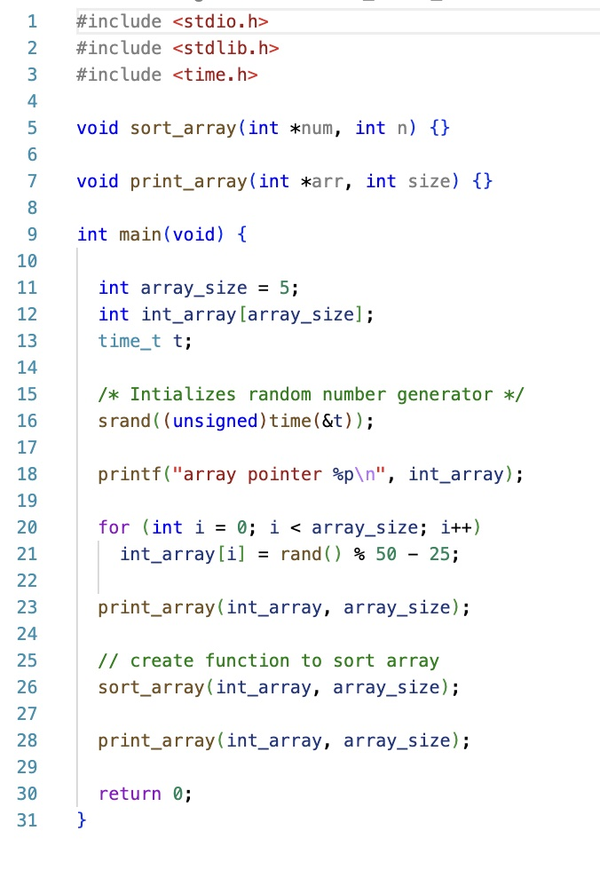

# CS100-Actvities

## Day

## Knowledge

* Reference and dereference operator
* Local variables
* Using pointers as function parameters

## Skills

_Programming skills_
Write, compile, and execute syntactically and logically correct code that:

* Obtains variable locations using reference operator,
* Accesses variable values by dereference operator,
* Uses pointers in assignments
* Modifies variable contents using pass by pointer,
* Passes reference types into function using pass by pointer including arrays and strings,

_Debugging skills:_
Use debugging strategies (printf/debugger) to:

* Verify a pointer operation as iterates through an array or C string correctly by tracing its execution
* Verify that parameters of pointer types are passed correctly, and mutations enabled by passed pointers are performed correctly

## Assignment
** Find a C algorithm on the Internet that sorts an array of numbers

Start with [main.c](main.c)

- Complete the function sort_array so that it sorts an array of numbers where num is the array pointer and n is the array size

- Complete the function print_array so that it prints an array num of size n

## Files

[main.c](main.c)

## Solution
[main_solution.c](main_solution.c)