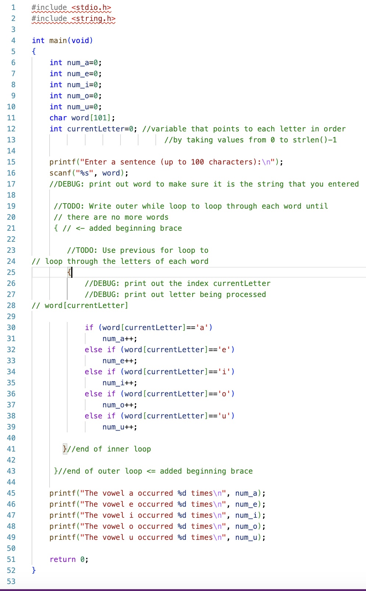

# CS100-Actvities


## Day

## Knowledge
* Loop logic
* True false evaluation (Boolean vs non-boolean)
* Syntax of while
* Syntax of for loop/++/-- operators; break/continue
* Loop semantics of initial value, value update and test expression
* True false evaluation (Boolean vs non-boolean)
* Choosing for vs while loop
* For/while loops over C string 
* Variable scope in for block (C99 internal declaration)
* End of input function feof(stdin)
* Redirection to/from stdin using > and <
* Abstraction of keyboard as a file-stdin
* Debug single or nested looping logic 

## Skills
_Design skills:_

Make appropriate design decisions when:

* Choosing between while loops and for loops, and
* Choosing how to terminate user input (sentinel or end of file)
* Choosing how to end a loop whether using an expression or using a break statement

_Programming skills:_

Write compile and execute syntactically and logically correct C program that:

* Write compile and execute syntactically and logically correct C program that:
* Uses while or for loop to execute a block of statements zero, one or many times based on an expression
* Read user input redirected from a file and redirect program output to a file
* Uses a nested loop to processes multidimensional data like a matrix

_Debugging skills:_

Use debugging strategies (printf/debugger) to:

* Verify that expressions that drive loops function as expected


## Assignment
 
Update an existing program to count the vowels in a sentence (multiple words delimited by space) using a nested loops.  Testing will use the method of redirecting input from a file rather than input data by typing at the keyboard.
 
Tasks:

1. Start with [vowels-sentence.c](vowels-sentence.c) (a modified copy of the [Selection-w-Strings](../Selection-w-Strings/README.md) lesson).
1. Update the initial printf and scanf to prompt for a sentence up to 100 words (update the definition of word) and scanf to scan in one word 
1. Add an outer loop to read each word in a loop until there are no more words.  This outer loop will consist of a while statement that terminates when end of file is reached.  There will be an additional set of braces that will enclose the existing for loop.
1. Before returning to check the outer loop condition, add a scanf to get the next word from the input
1. Begin testing by using the day12a.dat and the day12b.dat.  Create an additional 2 data files for testing.

```
./a.out <data1.dat
./a.out <data2.dat
```

 
_Hints:_
An example of reading in multiple words, is in zybooks section 2.14.  If you run into issues processing the words sequentially, consider adding a debug print statements to print out each word after it is read in to make sure it includes the string you expect




## Files
[Worksheet](processing  sentences.docx)<br>
[vowels-sentence.c](vowels-sentence.c)

[data1.dat](data1.dat)	
[data2.dat](data2.dat)	

## Solution
[vowels-sentence-solution.c](vowels-sentence-solution.c)