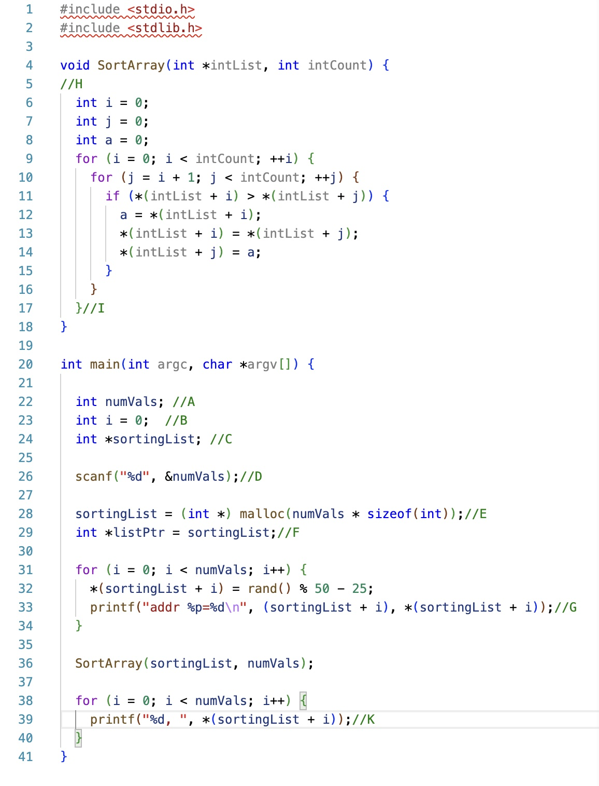

# CS100-Actvities

## Day

## Knowledge

* Reference and dereference operator
* Local variables
* Using pointers as function parameters
* Malloc and free function for variables
* Malloc/free for arrays and strings
* Typecasting with malloc
* sizeof macro

## Skills

_Debugging skills:_

Use debugging strategies (printf/debugger) to:

* Verify a pointer operation as iterates through an array or C string correctly by tracing its execution
* Verify that parameters of pointer types are passed correctly, and mutations enabled by passed pointers are performed correctly

## Assignment

1. Complete the worksheet with your predictions of the variable values in [code](main.c) will change at each indicated line.  Keep in mind that the first numbers of the pointers will vary so only write the last 3 characters.  Use the array size of 6.

1. Using the debugger in replit, verify addresses of the variables in the worksheet.  Use the array size of 6.

1. Compare your worksheet with the actual values.  Where did your predictions not match?  Why?

## Files
[Worksheet](Tracing worksheet.docx)

[main.c](main.c)

## Solution