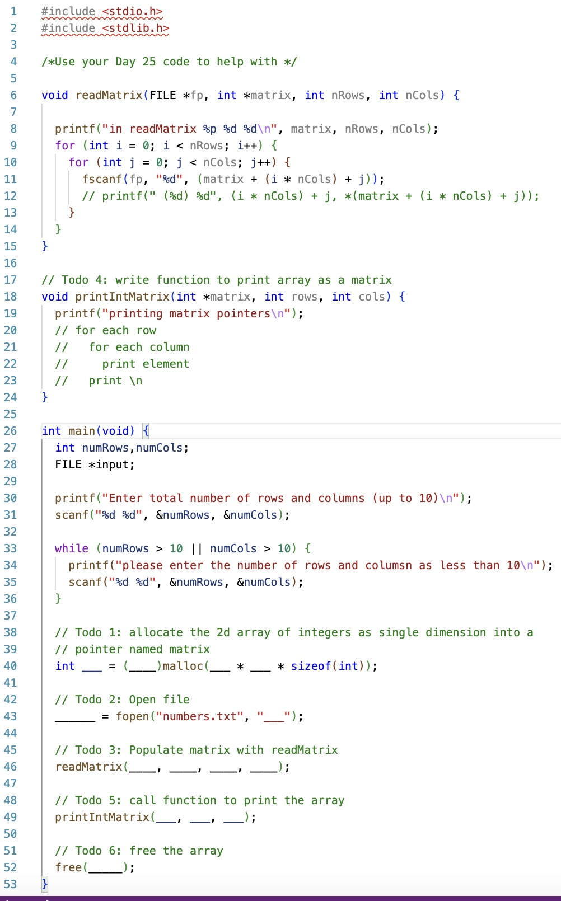

# CS100-Actvities

## Day

## Knowledge

* Reference and dereference operator
* Local variables
* Using pointers as function parameters
* Malloc and free function for variables
* Malloc/free for arrays and strings
* Typecasting with malloc
* sizeof macro

## Skills

_Programming skills_

Write, compile, and execute syntactically and logically correct code that:

* Obtains variable locations using reference operator,
* Accesses variable values by dereference operator,
* Uses pointers in assignments
* Prints pointer values using the correct format specifier,
* Modifies variable contents using pass by pointer,
* Passes reference types into function using pass by pointer including arrays and strings,
* Passes multiple dimension arrays in the formal parameters using a pointer to avoid providing 2nd dimension size at compile time,
* Iterates through single dimension or multiple dimension arrays using pointer arithmetic instead of indexes,
* Dynamically allocates space for a multiple dimension array using malloc, type casting and the sizeof macro,
* Accesses and modifies elements in a dynamically allocated data structure using dereferencing

_Debugging skills:_

Use debugging strategies (printf/debugger) to:

* Verify a pointer operation as iterates through an array or C string correctly by tracing its execution
* Verify that parameters of pointer types are passed correctly, and mutations enabled by passed pointers are performed correctly

## Assignment

Walk through [index-example.c](index-example.c) of converting between one and two dimensional array pointers

Update [main.c](main.c) to:

- Todo 1: allocate the 2d array of integers as single dimension into a pointer named matrix

- Todo 2: Open file

- Todo 3: Populate matrix with readMatrix

- Todo 4: write function to print array as a matrix

- Todo 5: call function to print the array

- Todo 6: free the array

## Files
[main.c](main.c)

## Solution
[main-solution.c](main-solution.c)