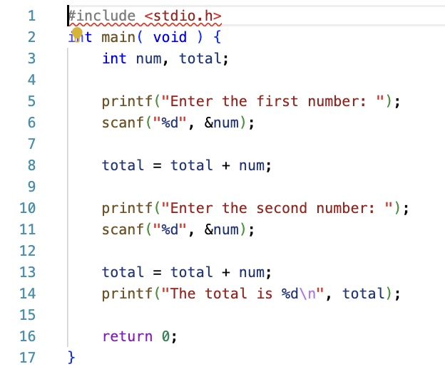

# CS100-Actvities

## Day

## Knowledge
* File as unit of persisted named storage and file types
* Compile and run program
* Keyboard is the standard form of input
* Variables as named storage
* Basic program syntax
* (main shell, stdio, scanf, printf)
* Declare, allocate and initialize whole numbers (int) 
* Read values from keyboard into variables of int
* Compiling and fixing syntax errors
* Format of assignment statements incl with same var on both sides
* Identifier naming requirements/reserved words
* Operators incl unary and compound
* Operator precedence
* Integer divide and modulo
* Declare, allocate and initialize floating point (double) types
* Read values from keyboard into variables of double
* Numeric literals/ scientific notation (we declare)
* Math functions incl rand/constants M_PI (declared for us)
* Type conversion and casting
* Format specifiers and format string
* Newline control character (\n)
* Single and multiline comments
* White space/ tab conventions
* Naming conventions
* Debugging to verify logic

## Skills

_Design skills:_

Make appropriate design decisions when:

* Selecting between numeric types (int vs double), (PA2.7.4, PA2.7.4.*)
* Applying integer divide and modulo, (PA-2.6.5, PA-2.6.2)
* Encoding calculations with arithmetic expressions, and
* Choosing variable type to store user data.

_Programming skills:_

Write, compile and execute a syntactically and logically correct C program that:

* Reads in a series of integer or real values,
* Performs correct calculations using operators, type conversion and casting, numeric, constants and math functions considering operator precedence,
* Prints formatted output using string literals, format specifiers, and control characters, and
* Follows acceptable style, white space, and naming conventions.

_Debugging skills:_

Use debugging strategies (printf/debugger) to:

* Identify arithmetic operation issues by tracing calculations,
* Verify input is saved properly, and
* Locating output formatting issues.

## Assignment

1. Run the following source on your local computer.

2. Login to cs-intro.ua.edu

3. Transfer or type in the following code.

4. Compare the output between the two executions.

## Files

[Video of using Unix server for development](day4-windows-cs-intro.mp4) 
[Unix session log](day4-sum_int.c_mac_nix.docx)

## Solution
NA

## Notes

Platforms can treat initialization of variables differently.  In this case, the variable total is not initialized on the Unix server, creating an error not present on Win32 platforms.